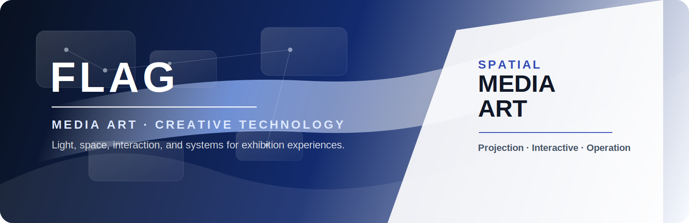

  

<h1 align="center">FLAG</h1>

  <strong>빛과 공간을 연결하는 미디어아트 파트너</strong> 
  Media Art · Exhibition Systems · Interactive Installations · Creative Technology

  
  
  

---

## Studio Direction

FLAG는 전시, 공간, 영상, 인터랙션, 운영 시스템을 하나의 경험으로 연결하는 미디어아트 팀입니다.  
빛의 흐름, 관객의 움직임, 현장 장비, 콘텐츠 운영을 정교하게 조율하여 공간이 스스로 반응하는 장면을 만듭니다.

| Field | What We Build |
| --- | --- |
| Media Art | 몰입형 영상, 프로젝션, 전시 콘텐츠, 공간 연출 |
| Media Facade | 건축 표면과 도시 공간을 활용한 대형 시각 경험 |
| Interactive Exhibition | 센서, 카메라, 관객 반응 기반 인터랙티브 프로그램 |
| Operation Systems | 현장 장비 점검, 콘텐츠 실행, 배포와 운영 자동화 |
| AI Workflow | 문서화, 검증, 반복 업무 자동화, 개발 보조 체계 |

## Creative Technology Stack

  
  
  
  
  

  
  
  
  
  
  

## Operating Principles

1. 현장에서 안정적으로 실행되는 결과를 우선합니다.
2. 작은 단위로 변경하고, 실행과 빌드로 확인합니다.
3. 프로젝트 구조, 수정 이유, 검증 결과를 문서로 남깁니다.
4. AI 도구는 속도를 높이는 동료로 사용하되, 최종 판단은 사람이 합니다.
5. 예술적 완성도와 운영 안정성을 같은 기준으로 다룹니다.

## Knowledge Portal

공식 개발 운영 기준은 아래 매뉴얼에서 확인할 수 있습니다.  
매뉴얼 본문은 회사 연락처 기반 암호 입력 후 열람됩니다.

  

## Contact

| Channel | Information |
| --- | --- |
| Website | <https://www.jso.kr/> |
| Phone | 010.8484.1611 |
| Email | <chan8819@naver.com> |
| Address | 대구광역시 서구 염색공단중앙로 7 |

---

  <strong>FLAG creates spatial experiences where light, technology, and people meet.</strong>

